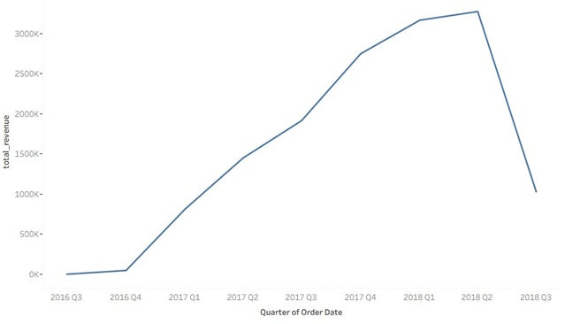

# Brazil E-Commerce SQL Analysis

## 📌 Project Overview
This project analyzes the Brazilian e-commerce dataset using SQL.  
The objective is to explore revenue patterns, order status performance, 
and validate financial consistency across transactional tables.

---

## 📊 Key Business Questions

1. How does revenue differ by order status?
2. Is item-level revenue consistent with payment-level transactions?
3. What business insights can be derived from order lifecycle data?

---

## 🗂 Dataset Tables Used

- `olist_orders_dataset`
- `olist_order_items_dataset`
- `olist_order_payments_dataset`
- `olist_customers_dataset`
- `olist_order_reviews_dataset`

---

## 📁 SQL Structure

sql/
├── revenue_validation.sql
├── kpi_scorecard.sql
├── product_analysis.sql
└── geo_analysis.sql


---

## 🔍 Example Analysis: Revenue by Order Status

This analysis compares:

- Item-level total price  
- Freight value  
- Payment value  

Grouped by order status to understand revenue distribution.

---

## 📈 Tools Used

- SQL Server
- Tableau (for visualization)

---

## 💰 Revenue Validation Query

```sql
SELECT 
    OrderStage,
    ROUND(SUM(payment_value), 0) AS total_payment
FROM (
    SELECT 
        CASE 
            WHEN o.order_status IN ('created','approved','invoiced','processing')
                THEN 'Pending'
            WHEN o.order_status = 'shipped'
                THEN 'Shipped'
            WHEN o.order_status = 'delivered'
                THEN 'Completed'
            WHEN o.order_status IN ('canceled','unavailable')
                THEN 'Failed'
            ELSE 'Other'
        END AS OrderStage,
        p.payment_value
    FROM olist_orders_dataset o
    LEFT JOIN olist_order_payments_dataset p
        ON o.order_id = p.order_id
) t
GROUP BY OrderStage
ORDER BY total_payment DESC;
```
### Result:


## 📈 Rapid Revenue Growth from 2016 to  2018
```sql
SELECT 
    CONCAT(
        YEAR(o.order_purchase_timestamp),
        ' Q',
        DATEPART(QUARTER, o.order_purchase_timestamp)
    ) AS order_quarter,
    
    ROUND(SUM(p.payment_value), 2) AS quarterly_revenue

FROM olist_orders_dataset o

JOIN olist_order_payments_dataset p
    ON o.order_id = p.order_id

WHERE o.order_status = 'delivered'

GROUP BY 
    YEAR(o.order_purchase_timestamp),
    DATEPART(QUARTER, o.order_purchase_timestamp)

ORDER BY 
    YEAR(o.order_purchase_timestamp),
    DATEPART(QUARTER, o.order_purchase_timestamp);
```
### Result:
<p align="center">
  
</p>


## 💳 Revenue Distribution by Payment Method
```sql
SELECT 
    payment_type,
    SUM(payment_value) AS total_revenue,
    ROUND(
        SUM(payment_value) * 100.0 
        / SUM(SUM(payment_value)) OVER (), 
        2
    ) AS revenue_pct
FROM olist_order_payments_dataset
GROUP BY payment_type
ORDER BY total_revenue DESC;
```

### Result:
<p align="center">
  
</p>

## 🏆 Top 10 Product Categories by Revenue
```sql
SELECT TOP 10
    t.product_category_name_english AS category,
    SUM(oi.price) AS total_revenue
FROM olist_order_items_dataset oi
LEFT JOIN olist_products_dataset p
    ON oi.product_id = p.product_id
LEFT JOIN product_category_name_translation t
    ON p.product_category_name = t.product_category_name
GROUP BY t.product_category_name_english
ORDER BY total_revenue DESC;
```
### Result:
<p align="center">
  
</p
