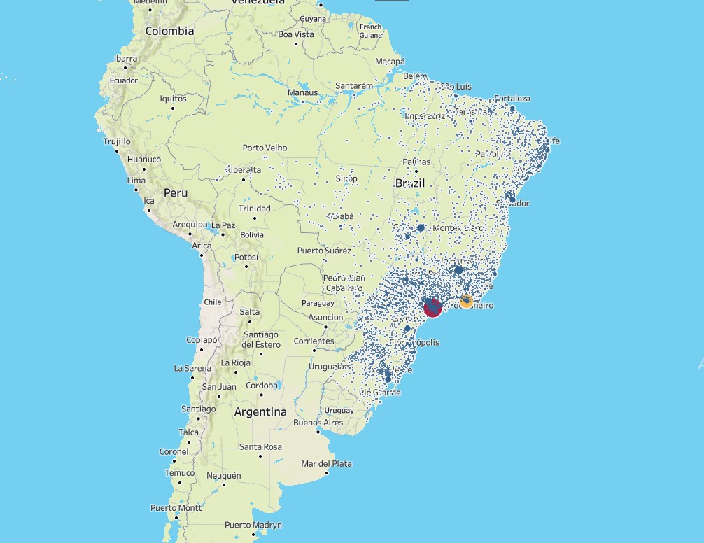

# 🛒 Brazil E-Commerce Revenue Analysis

## 📌 Project Overview
This project analyzes the Brazilian e-commerce dataset using SQL.  
Performance across order stages, payment methods, time trends, and product categories to identify key revenue drivers and potential business risks.

The goal is to answer:

- Which order stages contribute most to revenue?
- How has revenue evolved over time?
- Is the business overly dependent on specific payment methods?
- Which product categories drive the highest revenue?

---

## 🗂 Dataset Overview
##### Download link: https://drive.google.com/file/d/1a_WBLxE_40Br-HllAeeJE6v7XpfoHIHT/view?usp=sharing

- `olist_orders_dataset`
- `olist_order_items_dataset`
- `olist_order_payments_dataset`
- `olist_customers_dataset`
- `olist_order_reviews_dataset`
- `olist_products_dataset`
- `olist_geolocation_dataset`


---

## 💰 Revenue by Order Status

This analysis compares:

- Item-level total price  

Grouped by order status to understand revenue distribution.

---

## 📈 Tools Used

- SQL Server
- Tableau (for visualization)

---

```sql
SELECT 
    OrderStage,
    ROUND(SUM(payment_value), 0) AS total_payment
FROM (
    SELECT 
        CASE 
            WHEN o.order_status IN ('created','approved','invoiced','processing')
                THEN 'Pending'
            WHEN o.order_status = 'shipped'
                THEN 'Shipped'
            WHEN o.order_status = 'delivered'
                THEN 'Completed'
            WHEN o.order_status IN ('canceled','unavailable')
                THEN 'Failed'
            ELSE 'Other'
        END AS OrderStage,
        p.payment_value
    FROM olist_orders_dataset o
    LEFT JOIN olist_order_payments_dataset p
        ON o.order_id = p.order_id
) t
GROUP BY OrderStage
ORDER BY total_payment DESC;
```
### Result:


### 🔎 Key Insight

- Completed (delivered) orders contribute the overwhelming majority of revenue.

- Failed and pending orders represent potential revenue leakage.

- Operational efficiency directly impacts realized revenue.
  

## 📈 Quarterly Revenue Growth Trend
```sql
SELECT 
    CONCAT(
        YEAR(o.order_purchase_timestamp),
        ' Q',
        DATEPART(QUARTER, o.order_purchase_timestamp)
    ) AS order_quarter,
    
    ROUND(SUM(p.payment_value), 2) AS quarterly_revenue

FROM olist_orders_dataset o

JOIN olist_order_payments_dataset p
    ON o.order_id = p.order_id

WHERE o.order_status = 'delivered'

GROUP BY 
    YEAR(o.order_purchase_timestamp),
    DATEPART(QUARTER, o.order_purchase_timestamp)

ORDER BY 
    YEAR(o.order_purchase_timestamp),
    DATEPART(QUARTER, o.order_purchase_timestamp);
```
### Result:
<p align="center">
  
</p>

### 🔎 Key Insight

- Revenue increased steadily from 2017 to early 2018.

- Peak revenue occurred in Q2 2018.

- The decline in Q3 2018 is due to partial dataset coverage, not necessarily business contraction.
  

## 💳 Revenue Distribution by Payment Method
```sql
SELECT 
    payment_type,
    SUM(payment_value) AS total_revenue,
    ROUND(
        SUM(payment_value) * 100.0 
        / SUM(SUM(payment_value)) OVER (), 
        2
    ) AS revenue_pct
FROM olist_order_payments_dataset
GROUP BY payment_type
ORDER BY total_revenue DESC;
```

### Result:
<p align="center">
  
</p>

### 🔎 Key Insight

- Credit cards account for ~78% of total revenue.

- Strong dependency on a single payment method increases operational and financial risk.

- Alternative payment channels remain underutilized.
  

## 🏆 Top 10 Product Categories by Revenue
```sql
SELECT TOP 10
    t.product_category_name_english AS category,
    SUM(oi.price) AS total_revenue
FROM olist_order_items_dataset oi
LEFT JOIN olist_products_dataset p
    ON oi.product_id = p.product_id
LEFT JOIN product_category_name_translation t
    ON p.product_category_name = t.product_category_name
GROUP BY t.product_category_name_english
ORDER BY total_revenue DESC;
```
### Result:
<p align="center">
  
</p>

### 🔎 Key Insight

- Health & Beauty and Watches & Gifts generate the highest revenue.

- Revenue is moderately concentrated among top categories.

- Category concentration may indicate strategic focus areas or dependency risk.

- 
  
## 🗺 Geographic Distribution of Delivered Orders and Revenue
```sql
SELECT 
    c.customer_state,
    c.customer_city,
    g.avg_lat,
    g.avg_lng,
    COUNT(DISTINCT o.order_id) AS total_orders,
    SUM(p.payment_value) AS total_revenue

FROM olist_orders_dataset o

LEFT JOIN olist_customers_dataset c
    ON o.customer_id = c.customer_id

LEFT JOIN olist_order_payments_dataset p
    ON o.order_id = p.order_id

LEFT JOIN geolocation_clean g
    ON c.customer_zip_code_prefix = g.geolocation_zip_code_prefix

WHERE o.order_status = 'delivered'

GROUP BY 
    c.customer_state,
    c.customer_city,
    g.avg_lat,
    g.avg_lng

ORDER BY total_revenue DESC;
```
### Result:
<p align="center">
  
</p>

### 🔎 Key Insights

- Order activity is highly concentrated in Southeast Brazil, particularly around major economic regions.

- Cities such as São Paulo and Rio de Janeiro generate the largest share of delivered orders and revenue.

- Large metropolitan areas show significantly higher transaction density compared to other regions.

- The geographic concentration suggests strong demand clusters in urban economic centers.
